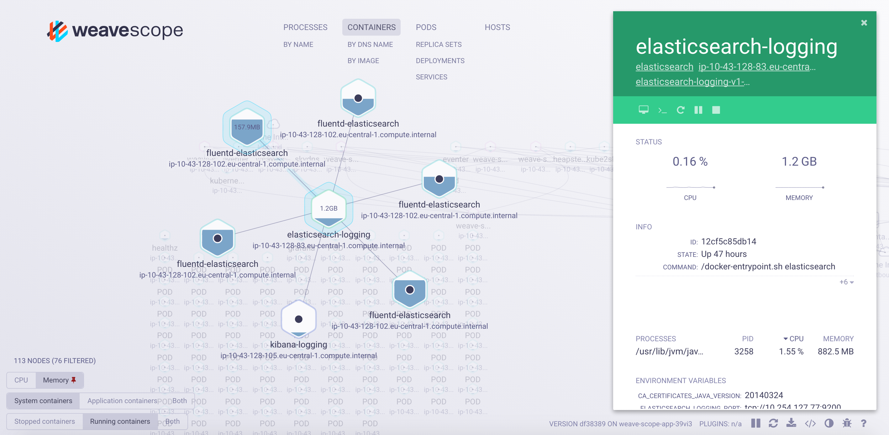

# Managing containerized microservices environments
Installation of software is really easy today. With the container registries acting like app-stores it's just a matter of seconds to pull and run a specific software locally, in a sandboxed environment. It's painless to evaluate even larger software-stacks like build-pipelines or messaging platforms. However, several things should be considered carefully when running things from the internet. Only few images on the registries come from verified accounts and not every image is battle-tested in production or even maintained. In enterprise environments this is a problem and quickly leads to the solution of curated container images, which are tested and originate from a trusted source.

## on app catalogues
App catalogues, or private registries which act as the basis, solve this problem by providing a curated list of software which can be used in production environments. Many PaaS systems have graphical app catalogues and allow for click-to-deploy mechanisms. With modern deployment tools it's even possible to run installations of distributed apps (e.g. rabbitmq, elasticsearch, redis, mysql, etc) in a high-availability fashion with just a single click.

After evaluating and selecting the proposed software stack, it can be deployed alongside the custom code.

## on environments
Prior to containers artifacts were managed on an infrastructure level, e.g. an AWS AMI as the ultimate result of the build process. This has the downside of only being executable on the respective cloud provider, high infrastructure costs and also longer provisioning times. With containers it's now possible to swap out whatever the (executable) build artifacts were, with a container image.

While containers provide isolated environments of resources, cluster application managers like kubernetes (which sits on top of Docker/rkt) or Swarm abstract from the underlying container technology to make it easy to deliver and manage microservices at scale. One particular feature which enables that are namespaces. A namespace in kubernetes is an isolated environment, e.g. all containers running in a namespace can only interact with eachother and don't know anything about other environments (made possible via network policies). There is a default namespace, which is used when deploying an application without arguments, but it's easy to create new namespaces (`kubectl create ns $NAME`). This allows for using a single kubernetes cluster for a continuous delivery pipeline with different testing stages, but having isolated environments nevertheless.

## on tooling
The state of tooling has greatly improved since the early days of Docker. Kubernetes, Swarm, OpenShift, Deis and others help to deploy and manage the huge amount of containers on respective infrastructure, overlay networks like Calico, Romana, Flannel and Weave DNS provide the migration path to cloud-native applications and features like auto-provisioning of storage allows for flexible scheduling of containers. There are dashboards for managing containers (e.g. Elastico, Kube-Dashboard) and cluster deployments tools like `helm/tiller`, `rancherctl` and `kpm`. With on-premise pipelines like spinnaker or gocd it's possible to manage deployments to Kubernetes, bringing CD pipelines to the container world.

A good example on how tooling improved is Weave Scope. It collects container and network information at a low level and allows to interact with distributed applications and its containers in real time, specifically:
* visualize microservice architecture
* direct access to logs
* shell inside the container
* cpu, memory consumption
* custom plugins

With the rise of environments it can be hard to keep the overview. Scope gives a boost in developer productivity, since it makes debugging easier and environments more approachable.

## looking forward
The ecosystem is really thriving and there are lots of things to look forward. The standardization of container formats and protocols (appc, oci, ..) to make runtimes pluggable. Rkt e2e tests for kubernetes are already close to 100%, which is great for removing another uid0 process in the stack. This could even open the doors to deploy other formats to the cluster, for example jar archives.
